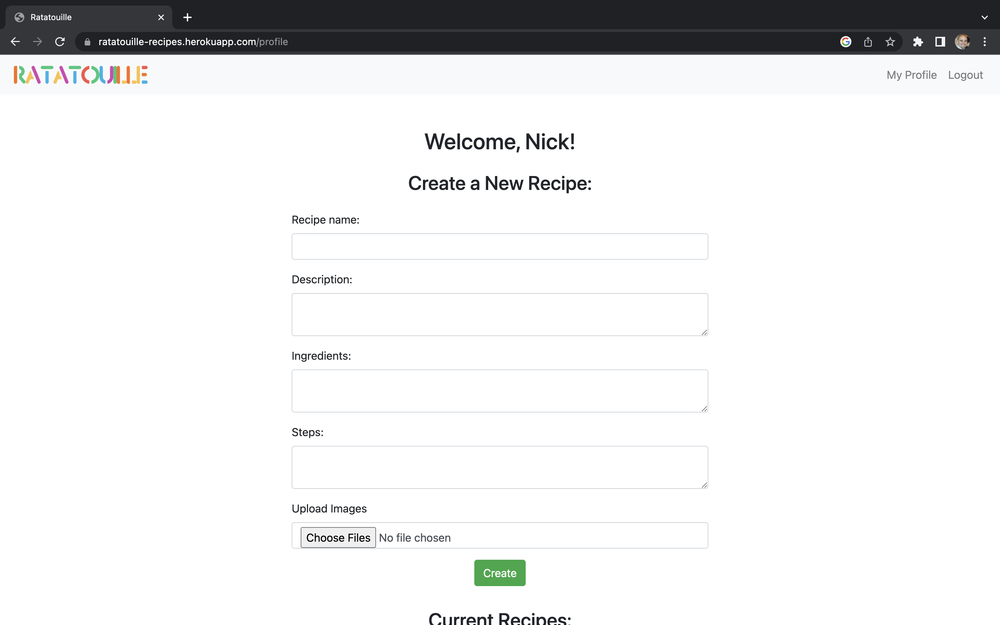
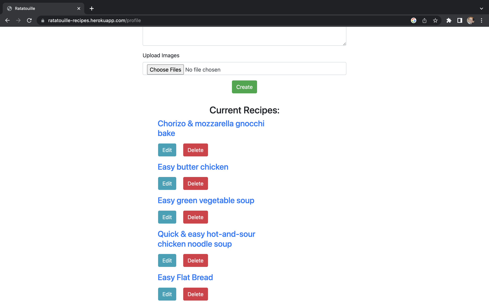
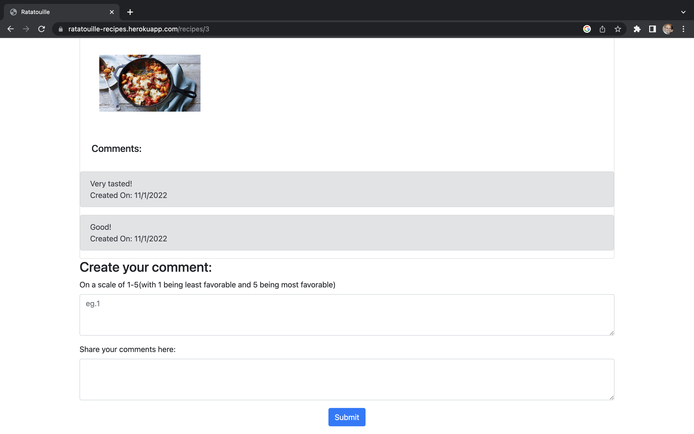
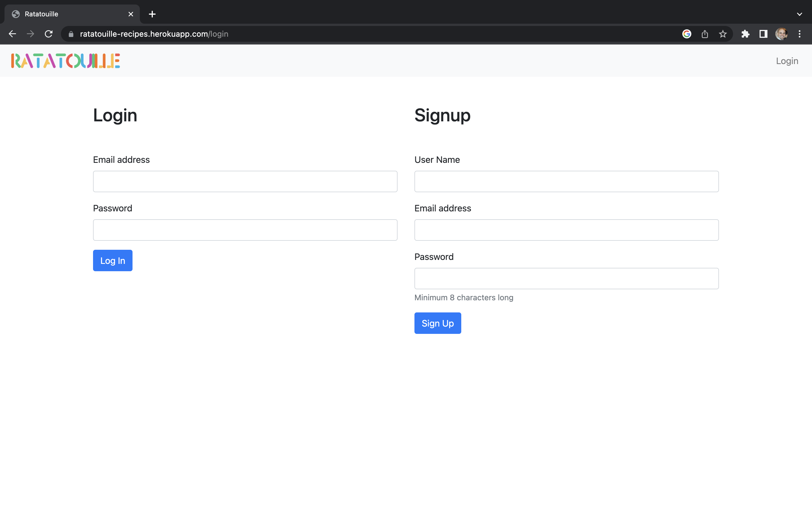

# Ratatouille

[](https://choosealicense.com/licenses/mit/)

## Description

- This application is for food blogger to come and share their recipes
- Users can sign up and login to share their favourite recipes.
- Members can also comment on other member's recipes for more inspiration!!!

## Table of Contents

- [Ratatouille](#ratatouille)
  - [Description](#description)
  - [Table of Contents](#table-of-contents)
  - [Installation](#installation)
  - [Usage](#usage)
  - [License](#license)
  - [How to Contribute](#how-to-contribute)
  - [Tests](#tests)
  - [Credits](#credits)
  - [Questions and Inquiry](#questions-and-inquiry)

## Installation

**IMPORTANT:** You will need to edit the ```.env.EXAMPLE``` file with your MySQL username and password and Cloudinary credentials, and rename it to ```.env``` in the root folder.

1. You will need to install all of the required ```npm``` modules by running ```npm install```.
2. You will need to implement the ```schema.sql``` script using your local MySQL server and running ```source db/schema.sql```
3. You will need to seed the database by running ```npm run seed```
4. You can run the application using ```npm start``` or ```node server.js```

## Usage

- Use this app to get recipe inspirations from members of this community.
- Browse through countless recipe ideas in the front page.
- You can also sign up and become part of the community and share your recipes.

## Screenshots

  

  

  

  

  


## License

All copyrights are covered under the MIT license

[](https://choosealicense.com/licenses/mit/)

## How to Contribute

- Contact the team via GitHub to help contribute.

## Tests

- N/A

## Credits

- Nick Pavlovic
- Kaye Xie
- Hao Zhou

## Deployment

1. GitHub: https://github.com/pav1593/Ratatouille

2. URL: https://ratatouille-recipes.herokuapp.com/


## Questions and Inquiry

[GitHub Profile](#https://github.com/pav1593)


For any questions or inquiries, you can the contributors of this project.

